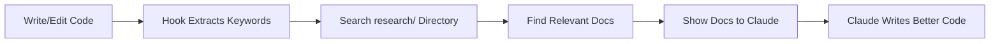

# Claude Code Hooks

This directory contains Claude Code hooks that automatically provide relevant documentation before coding operations.

## Documentation Hook

The `doc-reader-hook.py` script automatically:

1. **Extracts keywords** from your code (imports, API calls, etc.)
2. **Searches** the `/research/` directory for relevant documentation
3. **Shows documentation** to Claude before writing/editing files
4. **Ensures accuracy** by providing up-to-date API documentation

## Setup

The hooks are automatically configured via `.claude/settings.json`. When you use Write, Edit, MultiEdit, or Task tools, the hook will:

- Search for relevant docs in the `research/` folder
- Display documentation excerpts to Claude
- Block the operation initially to show the docs
- Allow Claude to retry with the documentation context

## How It Works



## Research Directory Structure

The hook expects documentation in this structure:
```
research/
├── openai/
│   ├── quickstart.md
│   ├── chat-completions.md
│   └── function-calling.md
├── pydantic-ai/
│   ├── agents.md
│   └── tools.md
└── other-apis/
    └── docs.md
```

This ensures Claude always has the latest, accurate documentation when implementing features.