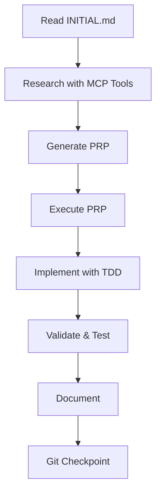

# Context Engineering Project Planning & Architecture
**Version:** 2025-07-14  
**Purpose:** Define the architecture, goals, and constraints for context engineering projects using this starter template.

## Table of Contents

1. [Project Overview](#project-overview)
2. [Architecture Principles](#architecture-principles)
3. [MCP Tool Architecture](#mcp-tool-architecture)
4. [Directory Structure](#directory-structure)
5. [Workflow Patterns](#workflow-patterns)
6. [Development Lifecycle](#development-lifecycle)
7. [Quality Standards](#quality-standards)
8. [Governance & Compliance](#governance--compliance)

---

## Project Overview

### Mission Statement
This context engineering starter template provides a comprehensive framework for building AI-powered applications with proper context management, MCP tool integration, and governance principles.

### Core Objectives
1. **Enable One-Pass Implementation**: Provide sufficient context for AI to implement features correctly on the first attempt
2. **Enforce Quality Standards**: Built-in validation, testing, and documentation requirements
3. **Leverage MCP Tools**: Integrate modern AI tools for research, reasoning, and testing
4. **Maintain Governance**: Follow established principles for security, compliance, and best practices

### Target Users
- Developers building AI-powered applications
- Teams implementing context engineering practices
- Projects requiring comprehensive documentation and testing
- Applications needing multi-agent orchestration

---

## Architecture Principles

### 1. Context-First Design
- **Comprehensive Context**: All necessary information available to AI assistants
- **Living Documentation**: Docs updated in real-time as code evolves
- **Research-Driven**: Use MCP tools to gather accurate, current information

### 2. Validation-Driven Development
- **Test First**: Write tests before implementation
- **Continuous Validation**: Check at every step
- **Automated Quality**: Built-in linting, type checking, coverage

### 3. Tool-Augmented Intelligence
- **MCP Integration**: Leverage specialized tools for specific tasks
- **Parallel Processing**: Use multiple tools simultaneously
- **Citation & Verification**: Track sources for all information

### 4. Progressive Enhancement
- **Start Simple**: Basic implementation first
- **Validate**: Ensure it works
- **Enhance**: Add features incrementally
- **Document**: Update docs with each change

---

## MCP Tool Architecture

### Tool Integration Layer
```
┌─────────────────────────────────────────────────┐
│              AI Assistant (Claude)               │
├─────────────────────────────────────────────────┤
│               MCP Tool Interface                 │
├─────┬─────┬─────┬─────┬─────┬─────────────────┤
│ C7  │ PLX │ BRV │ SEQ │ PLY │    Future...    │
└─────┴─────┴─────┴─────┴─────┴─────────────────┘

C7  = Context7 (Library Documentation)
PLX = Perplexity (AI Research)
BRV = Brave Search (Web Search)
SEQ = Sequential Thinking (Reasoning)
PLY = Playwright (Web Testing)
```

### Tool Selection Matrix

| Task Type | Primary Tool | Secondary Tool | Validation |
|-----------|--------------|----------------|------------|
| Library Research | Context7 | Perplexity | Cross-reference |
| Current Events | Brave Search | Perplexity | Multiple sources |
| Complex Planning | Sequential Thinking | TodoWrite | Step validation |
| Web Testing | Playwright MCP | - | Screenshot verification |
| API Documentation | Context7 | Brave Search | Version check |

### Research Workflow Architecture
```
1. Identify Need → 2. Select Tools → 3. Parallel Research
                                           ↓
6. Implementation ← 5. Synthesize ← 4. Store Results
        ↓
7. Validation → 8. Documentation → 9. Git Checkpoint
```

---

## Directory Structure

### Standard Layout
```
project-root/
├── .claude/                    # AI-specific configuration
│   ├── project/               # Project context files
│   │   ├── CLAUDE.md         # Project-specific rules
│   │   └── context.md        # Additional context
│   ├── commands/             # Custom Claude commands
│   │   ├── generate-prp.md   # PRP generation command
│   │   └── execute-prp.md    # PRP execution command
│   └── settings.local.json   # Tool permissions
│
├── src/                      # Source code (domain-driven)
│   ├── features/            # Feature-based organization
│   │   └── [feature]/       # Self-contained features
│   │       ├── __init__.py
│   │       ├── models.py
│   │       ├── services.py
│   │       └── api.py
│   ├── shared/              # Shared utilities (3+ users)
│   └── core/                # Core functionality
│
├── tests/                   # Test suite
│   ├── unit/               # Unit tests
│   ├── integration/        # Integration tests
│   └── e2e/                # Playwright e2e tests
│
├── docs/                    # Documentation
│   ├── decisions/          # ADR files
│   ├── specs/              # Feature specifications
│   ├── api/                # API documentation
│   └── capability-matrix.md # Feature inventory
│
├── research/                # MCP tool outputs
│   └── [topic]/            # Research by topic
│       └── [source].md     # Individual research files
│
├── PRPs/                    # Product Requirement Prompts
│   ├── templates/          # PRP templates
│   └── [feature].md        # Feature PRPs
│
├── config/                  # Configuration
│   ├── default.yaml        # Base configuration
│   └── [env].yaml          # Environment overrides
│
├── scripts/                 # Utility scripts
├── PLANNING.md             # This file
├── TASK.md                 # Task tracking
├── CLAUDE.md               # Global AI rules
└── research-log.md         # Research history
```

### Naming Conventions

| Type | Convention | Example |
|------|------------|---------|
| Python files | snake_case | user_service.py |
| JavaScript | camelCase | userService.js |
| Test files | test_[name] | test_user_service.py |
| Playwright | [feature].spec.ts | auth.spec.ts |
| Research | [topic]-[source].md | auth-context7.md |
| PRPs | [feature]-prp.md | user-auth-prp.md |

---

## Workflow Patterns

### 1. Feature Development Workflow


### 2. Research Pattern
```python
# Pattern for comprehensive research
async def research_feature(topic: str):
    # 1. Parallel research
    results = await gather(
        perplexity_ask(f"Best practices for {topic}"),
        brave_search(f"{topic} implementation examples"),
        context7_docs(resolve_library_id(topic))
    )
    
    # 2. Store findings
    for source, content in results:
        save_research(f"/research/{topic}/{source}.md", content)
    
    # 3. Update research log
    update_research_log(topic, results)
```

### 3. Validation Pattern
```bash
# Progressive validation gates
validate_level_1() {  # Syntax
    ruff check --fix
    mypy .
}

validate_level_2() {  # Tests
    pytest tests/unit -v
    pytest tests/integration -v
}

validate_level_3() {  # E2E
    playwright test tests/e2e/
}

validate_all() {
    validate_level_1 && \
    validate_level_2 && \
    validate_level_3
}
```

---

## Development Lifecycle

### 1. Planning Phase
- Read PLANNING.md and TASK.md
- Check existing capabilities
- Identify gaps and requirements
- Use Sequential Thinking MCP for complex planning

### 2. Research Phase
- Use MCP tools for comprehensive research
- Document all findings in /research/
- Create citations with sources and dates
- Update research-log.md

### 3. Design Phase
- Create/update PRP documents
- Include all context from research
- Define validation criteria
- Plan implementation steps

### 4. Implementation Phase
- Follow TDD approach
- Implement in small increments
- Validate after each section
- Create git checkpoints

### 5. Testing Phase
- Run unit tests first
- Integration tests second
- E2E tests with Playwright
- Fix all issues before proceeding

### 6. Documentation Phase
- Update relevant .md files
- Generate API docs if needed
- Update capability matrix
- Document decisions

### 7. Review Phase
- Code review checklist
- Documentation review
- Test coverage check
- Performance validation

---

## Quality Standards

### Code Quality Metrics
| Metric | Standard | Tool |
|--------|----------|------|
| Test Coverage | ≥ 85% | pytest-cov |
| Type Coverage | 100% | mypy |
| Linting | Zero errors | ruff |
| Complexity | ≤ 10 | radon |
| Documentation | All public APIs | pydoc |

### Documentation Standards
- **README**: < 500 lines, focused on quick start
- **API Docs**: Generated from code annotations
- **Decision Records**: ADR format with rationale
- **Research**: Cited sources with retrieval dates

### Testing Standards
- **Unit Tests**: Every function/method
- **Integration**: API endpoints, service interactions
- **E2E**: Critical user journeys with Playwright
- **Performance**: Response time < 200ms (p95)

---

## Governance & Compliance

### Security Requirements
1. **No Hardcoded Secrets**: Use environment variables
2. **Input Validation**: All external inputs sanitized
3. **Least Privilege**: Minimal permissions
4. **Audit Logging**: All significant actions logged

### Compliance Checklist
- [ ] All MCP tool usage documented
- [ ] API rate limits respected
- [ ] Data privacy considered
- [ ] Security scan passed
- [ ] Dependencies up to date
- [ ] License compatibility verified

### Change Management
1. **Version Control**: Semantic versioning
2. **Change Log**: Document all changes
3. **Migration Scripts**: For breaking changes
4. **Rollback Plan**: Document and test

### Review Gates
1. **Automated Checks**: Must pass CI/CD
2. **Peer Review**: For complex changes
3. **Documentation Review**: Completeness check
4. **Security Review**: For sensitive changes

---

## Best Practices Summary

### DO:
- ✅ Use MCP tools for all research
- ✅ Document sources and dates
- ✅ Test incrementally
- ✅ Create git checkpoints
- ✅ Update docs as you go
- ✅ Follow existing patterns
- ✅ Validate continuously

### DON'T:
- ❌ Rely on training data alone
- ❌ Skip validation steps
- ❌ Create files > 500 lines
- ❌ Ignore test failures
- ❌ Hardcode configuration
- ❌ Suppress exceptions
- ❌ Create new patterns unnecessarily

---

## Future Enhancements

### Planned Features
1. **Additional MCP Tools**: Integration with more specialized tools
2. **Multi-Agent Orchestration**: Coordinate multiple AI agents
3. **Advanced Caching**: Reduce redundant MCP calls
4. **Metrics Dashboard**: Real-time project health
5. **Automated Documentation**: Generate from code changes

### Extension Points
- Custom MCP tool integration
- Project-specific validation rules
- Domain-specific templates
- Workflow automation scripts

---

Remember: **This is a living document. Update it as the project evolves!**